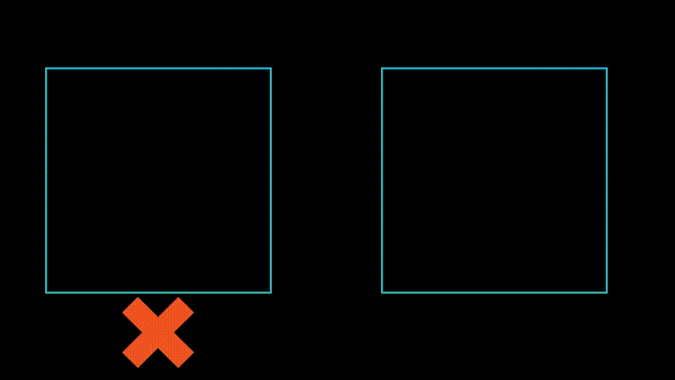

# let-me-down

[](https://www.npmjs.org/package/let-me-down)
[](https://github.com/prettier/prettier)
[![npm download][download-image]][download-url]
[](https://github.com/semantic-release/semantic-release)

[download-image]: https://img.shields.io/npm/dm/let-me-down.svg?style=flat-square
[download-url]: https://npmjs.org/package/let-me-down

`LetMeDown` is a React component to always keep Footer component of your application at bottom of screen and below the content on page.



## Maintainers

[Shivam Pawar](https://github.com/shivam-pawar) Active maintainer - accepting PRs and doing minor testing, fixing issues or doing active development.

## Installation

```sh
npm install let-me-down
```

## Prerequisite

```
"react": ">=16.8"
"react-dom": ">=16.8"
```
## Usage

1 . Import let-me-down after installation

```js
import LetMeDown from 'let-me-down';
```

2 . Add property footerComponent= {<Your_Footer_Component />} to LetMeDown component.

```jsx
<LetMeDown footerComponent={<Footer />}>
    <Content />
</LetMeDown>
```

### Standalone

You can import `node_modules/let-me-down/dist/index.js` into your page. Please make sure that you have already imported `react` and `react-dom` into your page.

## Author

**Shivam Pawar**

- 👨‍🎓 [Profile](https://github.com/shivam-pawar "Shivam Pawar")

- 📧 [Email](mailto:shivampawar1038@gmail.com)

- 🌐 [Website](https://shivam-pawar.vercel.app/ "Welcome")

## 🤝 Support

Contributions, issues, and feature requests are welcome!

Give a ⭐️ if you like this project!

<a href="https://www.buymeacoffee.com/shivampawar" title="Buy me a Coffee"></a>
